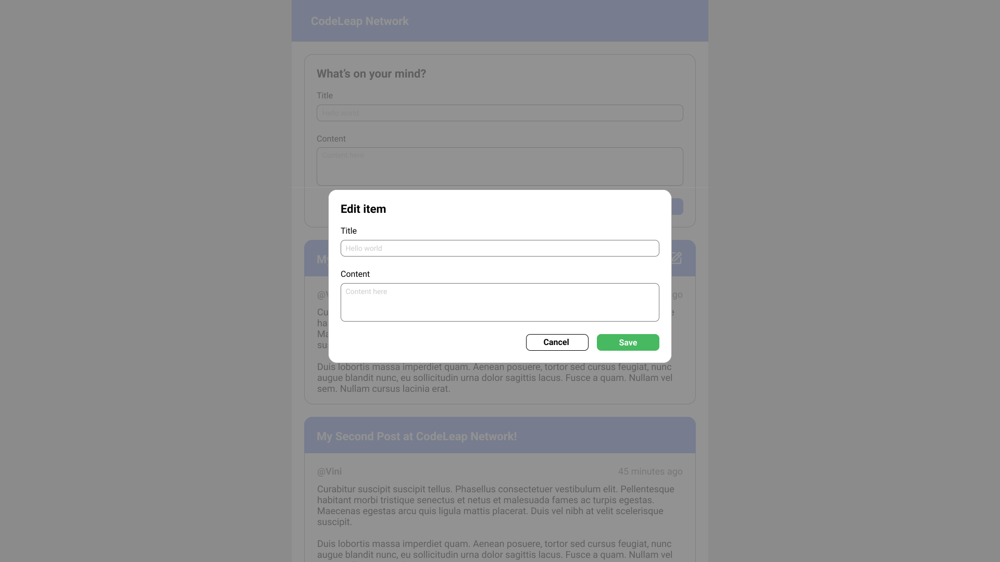

# Codeleap Test


The goal is to create a very simple application that will perform basic CRUD functions.


### Introduction
  - Front-End: If you’re applying for frontend, please feel free to choose either React or React-Native to build this application.
This example is designed for the web, but if you choose to build it with React-Native for mobile, feel free to do the necessary UI changes to fit the different device requirements.

# Requirements and Layout

- Signup: The first screen is a “signup modal” type of screen.
You do not have to create users in the backend. Just keep the username string somewhere in the frontend so we can submit it when creating a post later on.
<br/>
<br/>


- Main Screen : This page contains several different features:
  - Ability to create posts
  - Ability to fetch and read posts from our test backend
  - Open delete alert (only your own items)
  - Open edit modal (only your own items)
  - The list of items should update automatically when a new post is created.
  - Sort the list by the most recent on top.
<br/>
<br/>
  

- Delete Alert: When deleting an item, show a modal to confirm.
<br/>
<br/>
  

- Edit item modal: Self explanatory, make a modal to edit the existing items in the list.
<br/>
<br/>
  


# Technologies used

- Javascript
- Typescript
- ReactJs
- React-query
- Redux
- Styled-components
- React-icons
- React-toastify

# How to run project

Open your command line (cmd, gitbash, zsh) in a folder of your choice and run the following commands below:

```
 $ git clone https://github.com/zkauansantos/test-codeLeap.git

 $ cd test-codeLeap

 $ yarn install or npm install

 $ yarn dev or npm run dev

```

- View the application at http://localhost:300
